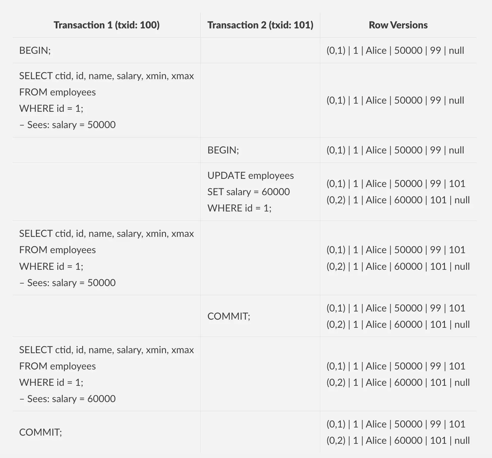
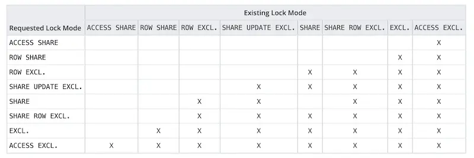

# PostgreSQL 中表级锁剖析

本文解释了 PostgreSQL 中的锁机制，重点关注数据定义语言 (DDL) 操作所需的表级锁。

<!-- more -->

## 锁定和解锁的艺术？

人们常常通过类比物理锁来理解数据库锁，这甚至可能促使您去订阅关于锁的历史、波斯锁以及开锁技巧的书籍。然而，大多数人最终会通过深入研究“锁定”（`locking`）这个术语来理解 PostgreSQL 中的锁概念，而这个概念实际上和物理锁没有什么关系，因为物理锁主要与安全性相关。而 PostgreSQL 的锁完全是为了并发控制，其核心是管理事务之前的相互协作——允许一个事务持有锁的同时，另一个事务能够完成自己的操作，并尽量避免相互阻塞。但正如我们所知，世界并不总是理想的，无论是门锁还是 `AccessSharedLock`。

然而，既然我已经买了那些关于锁的书，我想我应该可以对开锁的艺术和数据库锁定机制进行一些类比。首先我要说的是：为了能够撬开任何类型的锁，您需要对它的内部运作有深入的理解；了解锁销、锁芯以及它们相互作用的机制。通过操纵它们，您可以找到不用钥匙就能打开门或保险箱的正确位置！同样为了能够管理数据库锁，您需要了解数据库的内部工作原理，尤其是 PostgreSQL 中并发的工作原理。

## MVCC 简介

PostgreSQL 使用**多版本并发控制（Multi-Version Concurrency Control, MVCC）**来避免传统上与数据库相关的许多锁定问题。MVCC 的工作原理是：

- 写入新的数据库副本，而不是原地修改行。
- 确保**读取不会阻塞写入，并且写入不会阻塞读取**。

当事务更新数据时，PostgreSQL 会创建改行的新版本，同时保留旧版本。每个行版本都包含用户不可见但多 MVCC 至关重要的系统列：

- `xmin`：创建此版本的事务 ID
- `xmax`：删除/更新此版本的事务 ID（如果为当前版本则为空）
- `cmin`, `cmax`：事务中的命令 ID
- `ctid`：行版本的物理位置

当使用默认的读已提交隔离级别（Read Committed Isolation Level）时，每次执行语句时，PostgreSQL 都会创建一个快照其中包含：

- 当前所有活跃事务 ID
- 最新提交的事务 ID
- 正在进行的事务列表

让我们看看它在读已提交隔离级别下的实际工作原理：

MVCC 示例

总而言之，存在一行，其中 Alice 的工资为 50000。第一个事务（`txid:100`）启动并获取其 `SELECT` 语句的快照，并看到 Alice 的薪水为 50000，因为该行的 `xmax` 为空（意味着它是当前的），该行的 `xmin`（`99`）小于我们的事务 ID（`100`）并且事务 `99` 已提交。

第二个事务（`txid:101`）将薪水更新为 60000。这将创建两个行版本；旧版本标记为 `xmax=101`，新版本标记为 `xmin=101`。然后第二个事务提交，使其更改对任何新快照都可见。

当第一个事务执行其第二个 `SELECT` 语句时（在第二个事务提交之前），它仍然看到薪水 50000，因为第二个事务 `101` 尚未提交。在第二个事务提交之后，当第一个事务执行它的第三个 `SELECT` 语句时，获得一个新的快照（读取已提交行为）并且现在看到薪水 60000，因为：

- 每个语句获取一个新的快照
- 事务 `101` 现在已经提交
- `xmin=101` 的行版本是当前版本（`xmax` 为空）
- `xmax=101` 的旧版本对于新快照不再可见

此行为特定于读已提交隔离级别，其中每个语句都会获得一个新的快照，并且可以看到来自其他事务的已提交的更改，即使在同一个事务中也是如此。

当然，MVCC 方法也带来了一些影响：

- 死亡元组会不断积累，直到被 `VACUUM` 清理
- 由于保留多个版本，数据库大小可能会暂时增大
- 定期进行 `VACUUM` 维护对于性能至关重要

最终获得明显的好处是，MVCC 设计允许 PostgreSQL 为长时间运行的查询提供一致的快照（希望它们不会运行太久😄），为混合读写工作负载提供高并发性，并在不进行过多锁定的情况下提供强大的隔离性。

## 锁定的目的

所有锁定，无论其类型如何，都会降低吞吐量，并可能增加延迟，这意味着性能损失，因此没有什么是免费的。如果我的目的是确保我的数据没有损坏，并且每个人在查询时都得到正确的结果，那么我必须保证当多个事务针对一张表或同一行时，我必须锁定访问以确保我们花一些时间来保持事物的顺序而不是快速地显示错误的结果。

但是我们也不能保留锁太久，因为这也会带来后果。让我们想象一下两个极端：我们从不锁定任何事务。一份长期运行的财务报告正在计算各部门的平均值，而人力资源部正在处理年终加薪，与此同时，我们尝试添加一个新的审计栏。在 PostgreSQL 中，即使没有显示锁，添加列也需要对表进行 `AccessExclusiveLock`。如果我们以某种方式绕过这个问题（想象一种假设的不安全模式），我们将会看到真正的混乱：由于在事务中遇到不同的表结构，薪水更新可能会失败，并且由于系统目录与实际表数据不一致，后续查询可能会面临数据损坏。虽然听起来很忙乱，但如果不锁任何东西就会造成不同程度的混乱。

现在，让我们考虑另一个极端：我们锁定每个操作，每个操作都等待另一个操作；一个操作完成，另一个操作开始。我们为一个正在读取的查询阻止整个表。如果一些用户可能使用小型数据库，而从来不必在同一时间查询同一张表，那么这也是可以的；就像运行夜间报告的单用户会计系统一样。

当我们需要同时为多个用户提供服务时，我们必须接受一定程度的隔离，因此，我们要确保同意一个标准，以确保我们不会出现脏读或幻读等情况。这就是为什么 PostgreSQL 提供从读已提交到可序列化的[不同隔离级别](https://www.postgresql.org/docs/current/transaction-iso.html)。

## DDL 锁

MVCC 方法使 PostgreSQL 能够高效地执行并发 DML 操作。写入操作不会修改数据，而是创建数据的新副本，从而允许读取和写入操作互相不阻塞地进行。然而，即使在基于 MVCC 的系统中，某种程度的锁定也是不可避免的。读取可能不会阻止写入，但它们仍然会获取表、类型和视图等数据库对象上的轻量级锁。

因此，MVCC 可以保护您免受写入阻止读取的影响，但不能保护您免受 DDL 命令所采取的对象锁的影响。同一 DDL 命令的不同变体可能需要不同级别的锁强度。

对于 DDL 操作（例如 `ALTER TABLE` 或 `VACUUM FULL`），通常需要更强的锁，这可能会阻塞其他操作。此类操作可能会阻止其他 DDL 命令、DML 操作，甚至阻止尝试访问同一对象的 `SELECT` 查询。由于每个 DDL 命令（有时甚至是子命令）都有自己特定的锁定要求，因此复杂性会增加，为此了解繁忙数据库中模式修改的含义至关重要。

## 表级锁模式

让我们看一下各种表级锁模式，每种模式都服务于不同的操作：

- **ACCESS SHARE**：`SELECT` 操作使用的最基本的锁，多个事务可以同时持有此锁，限制最少。
- **ROW SHARE**：由 `SELECT FOR UPDATE/SHARE` 使用，与除排他锁之外的大多数其他锁兼容。
- **ROW EXCLUSIVE**：DML 操作 (`INSERT`/`UPDATE`/`DELETE`/`MERGE`) 必需。
- **SHARE UPDATE EXCLUSIVE**：由 `VACUUM`、`ANALYZE` 和 `CREATE INDEX CONCURRENTLY` 等维护操作使用，与 `ShareLock`、`ShareRowExclusiveLock`、`ExclusiveLock` 和 `AccessExclusiveLock` 冲突。
- **SHARE**：`CREATE INDEX` 需要。
- **SHARE ROW EXCLUSIVE**：创建触发器时使用。
- **EXCLUSIVE**：类似于 `REFRESH MATERIALIZED VIEW CONCURRENTLY` 等操作必需。
- **ACCESS EXCLUSIVE**：最强的锁，由 `DROP TABLE`、`TRUNCATE`、某些 `ALTER TABLE` 命令和 `VACUUM FULL` 等操作使用。最严格，阻止所有并发访问，并且需要大多数架构修改。

我认为，知道哪些操作获得哪些锁很重要，但可以轻松检查。理解锁模式如何相互作用可能更为重要。[不同的锁模式与其他不同的模式相冲突](https://www.postgresql.org/docs/current/explicit-locking.html#LOCKING-TABLES)。

锁冲突

有几个关键点需要理解，`ACCESS EXCLUSIVE` 与所有锁模式冲突，包括 `ACCESS SHARE` (`SELECT`)。PostgreSQL 进行了许多优化，在可能的情况下采用较弱的锁模式。然而，没有什么是完美的，它仍然会对某些 DDL 操作采取强锁。一旦事务采取强锁，即使语句已完成，它也会持有该锁。

一个重要的教训是，DDL 操作可能会在整个事务持续期间阻止写入和读取。因此，避免在同一事务中混合使用需要强锁的命令至关重要。例如，如果您需要执行表更改和数据更新，最好将它们分成不同的事务以最大限度地减少阻塞。

## 了解 PostgreSQL 中锁队列

当一个事务请求的锁与另一个事务已经持有的锁冲突时，它会进入**锁队列（lock queue）**。默认情况下，请求事务将无限期地等待，直到锁可用。这些等待的锁形成一个队列，但不幸的是，这个队列在 `pg_locks` 系统视图中不能直接看到。相反，您可以使用 `pg_blocking_pids()` 函数来识别哪些后端正在阻塞特定后端。

队列中位于前面的锁可能会阻塞位于其后面的锁，从而导致级联延迟。例如：

1. 长时间运行的 `SELECT` 持有 `ACCESS SHARE LOCK`。
2. `ALTER TABLE DETACH PARTITION` 需要短暂的 `ACCESS EXCLUSIVE LOCK`。
3. 但它们发生冲突，因此 `ALTER TABLE` 被放在锁队列中。
4. 另外 20 个后端正在尝试执行简单的主键查找 `SELECT`。
5. 但它们与 `ALTER TABLE` 的锁冲突，所以它们排在 `ALTER TABLE` 操作后面。
6. 现在，对给定表的所有访问都已排队，并且直到长时间运行的 `SELECT` 和 `ALTER TABLE` 都完成之前不会进行任何处理。

这种累积的等待会严重影响性能，尤其是在高并发环境中。使用 `lock_timeout` 来限制事务等待锁的时间。对于 DDL 操作，设置 `lock_timeout` 通常足以防止复杂的等待场景。但是，在实现超时时，您的应用程序必须准备好妥善处理故障，通常是通过为超时的 DDL 操作实现**重试逻辑（retry logic）**。

从中得到的最大启示是，**任何长时间运行的查询**都可能在模式更改期间造成阻塞，但可以通过设置适当的 `lock_timeout` 值来减轻这种累积等待效应。

如果您想了解更多，我们还有一篇有关[模式更改和 PostgreSQL 锁队列](https://xata.io/blog/migrations-and-exclusive-locks)的精彩博客文章。

## 将一切锁定在一起

我注意到这篇文章已经很长了，但我还有很多话要说。因此，我将在这里结束本文，并写一篇后续文章来讨论锁争用以及如何在必要时尽量减少锁的影响。

截至目前，我们已经探讨了 MVCC 如何帮助处理并发事务以及各种锁模式如何保护数据完整性。我们已经看到，锁的范围从更宽松的 `ACCESS SHARE` 到更严格的 `ACCESS EXCLUSIVE`，每种锁在维护数据一致性方面都发挥着至关重要的作用。虽然 MVCC 避免了许多传统的锁定问题，但某种程度的锁定仍然不可避免。关键是找到正确的平衡点，锁定太少会导致数据损坏的风险，而锁定太多则会造成不必要的瓶颈。

总而言之，以下是本文的要点：

- MVCC 将保护您免受写入阻止读取的损害，但不能保护您免受 DDL 所采取的对象锁的损害。
- 同一 DDL 命令的不同变体可能需要非常不同的锁强度。
- DDL 可能会阻止事务整个运行期间的写入和/或读取。
- 不要将需要强锁的命令与在同一事务中工作的其他命令混合。
- 使用 `lock_timeout` 来限制等待锁的时间。
- 对 DDL 命令使用 `lock_timeout` 通常就足够了。必须能够处理故障，例如再次重试 DDL。

我将于 1 月 17 日在 [PGDay CERN](https://indico.cern.ch/event/1471762/timetable/#20250117) 上介绍这个主题，如果您在的话，请过来打个招呼！

请继续关注即将发布的文章。

> 作者：Gulcin Yildirim Jelinek 
> 原文：[https://xata.io/blog/anatomy-of-locks](https://xata.io/blog/anatomy-of-locks)
