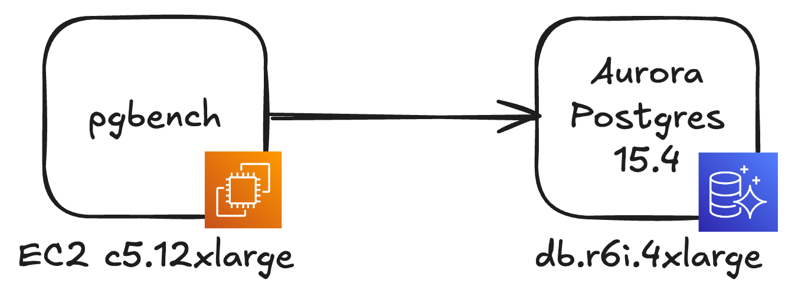
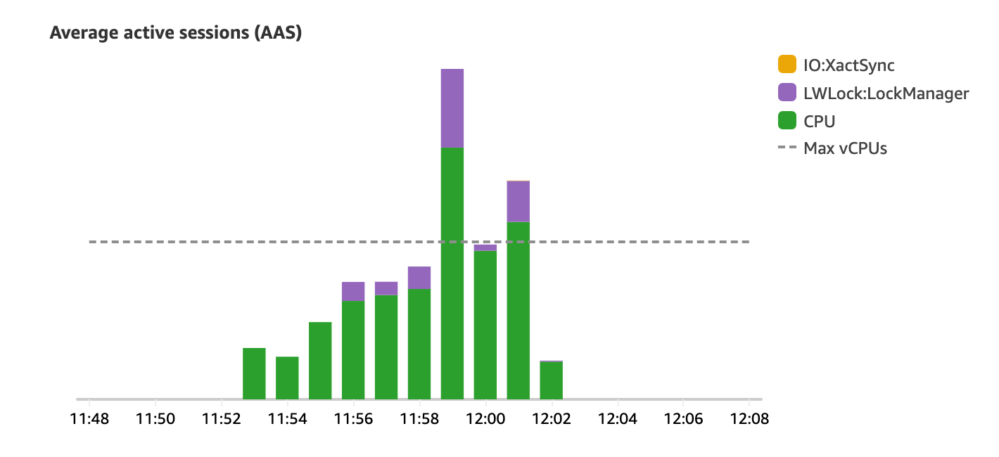

# 处理 Aurora Postgres 中的 LWLock:LockManager 等待事件

## 什么是轻量级锁

PostgreSQL 通过轻量级锁（Lightweight Locks, LWLocks）控制对共享内存中的数据结构的访问。与表锁或行锁不同，轻量级锁通常持有很短的时间，并且不受正在进行的事务的约束。作为数据库客户端，您无法直接控制何时获取这些锁。它们在后台运行，并且由 PostgreSQL 自身管理。

本文将探讨 PostgreSQL 的锁管理器、轻量级锁、快速路径锁（fast-path locking）以及如何对抗 `LWLock:LockManager` 等待事件。

<!-- more -->

## 轻量级锁与锁管理器

每当您在 PostgreSQL 中与关系（表或索引）交互时，系统都会获取该关系的锁。这些锁通常被称为重量级锁。这似乎有悖常理，但即使是只读查询也会获取 PostgreSQL 需要跟踪的锁。

为了加速锁获取，PostgreSQL 使用一种称为快速路径锁（[fast-path locking](https://github.com/postgres/postgres/blob/4766438aa317e85f3d762847b2b009f91f530b6f/src/backend/storage/lmgr/README#L257)）的机制。此技术用于使用“弱”关系锁（`AccessShareLock`、`RowShareLock` 或 `RowExclusiveLock`）的场景，并且仅当系统可以快速验证不存在冲突锁时才使用。

每个事务允许获取 [16 个快速路径锁](https://github.com/postgres/postgres/blob/8afff7d6db25ab52f155d8a220f692d7d6d84152/src/include/storage/proc.h#L86)。

``` c
/*
 * We allow a small number of "weak" relation locks (AccessShareLock,
 * RowShareLock, RowExclusiveLock) to be recorded in the PGPROC structure
 * rather than the main lock table.  This eases contention on the lock
 * manager LWLocks.  See storage/lmgr/README for additional details.
 */
#define		FP_LOCK_SLOTS_PER_BACKEND 16
```

一旦超出限制，后续的锁获取就必须通过锁管理器。根据工作负载的类型，这可能会造成锁获取争用，从而降低工作负载的速度。

## Fast-Path 示例

为了更好地理解快速路径，亲自体验一下会有所帮助。`pg_locks` 视图显示活动进程持有的锁的信息。当通过快速路径获取锁时，`fastpath` 列将被设置为 `true`。

让我们进行以下实验。在一个数据库会话中，我们将启动一个事务，然后在不同的表上执行多个选择查询。这样，我们将在每个关系上获取一个锁。同时，我们打开另一个数据库会话，并观察 `pg_locks` 表。

启动一个新事务并执行 `select` 语句。针对此场景，我创建了多个空表。

``` sql title="Session 1"
begin;
select * from test1;
```

在第二个数据库会话中，查看 `pg_locks`；

``` sql title="Session 2"
select relation::regclass, locktype, pid, mode, fastpath
from pg_locks
where pid != pg_backend_pid();  -- 过滤掉此查询获取的锁
```
进程 ID 51 对应的是第一个数据库会话中的后端进程。我们可以看到两个锁。`AccessShareLock` 是由 `test1` 表上的 `select` 语句获取的。而 `ExclusiveLock` 是针对虚拟事务 ID 的锁。

```
 relation |  locktype  | pid |      mode       | fastpath 
----------+------------+-----+-----------------+----------
 test1    | relation   |  51 | AccessShareLock | t
          | virtualxid |  51 | ExclusiveLock   | t
(2 rows)
```

在第一个数据库会话中，如果我们继续对尚未触及的关系执行额外的选择语句，我们可以看到进程 51 获取的锁数量将会增加。

``` sql title="Session 1"
-- 第一个数据库会话中
select * from test2;
```
```
 relation |  locktype  | pid |      mode       | fastpath 
----------+------------+-----+-----------------+----------
 test2    | relation   |  51 | AccessShareLock | t
 test1    | relation   |  51 | AccessShareLock | t
          | virtualxid |  51 | ExclusiveLock   | t
(3 rows)
```

快速路径不仅适用于 `select` 语句，还适用于 `insert`、`update` 和 `delete`。

``` sql title="Session 1"
-- 第一个数据库会话中
insert into test1 (id, value) values (1, 'hello');
update test2 set value = 'hello';
```

现在我们可以看到又出现了两个关系锁。`RowExclusiveLocks` 是在插入、更新或执行删除操作时获取的。

```
 relation |   locktype    | pid |       mode       | fastpath 
----------+---------------+-----+------------------+----------
 test2    | relation      |  51 | AccessShareLock  | t
 test2    | relation      |  51 | RowExclusiveLock | t
 test1    | relation      |  51 | AccessShareLock  | t
 test1    | relation      |  51 | RowExclusiveLock | t
          | virtualxid    |  51 | ExclusiveLock    | t
          | transactionid |  51 | ExclusiveLock    | f
(6 rows)
```

到目前为止，所有操作都已获取快速路径锁。如果我们继续在关系上获取新的锁，最终将达到每个事务 16 个快速路径锁的限制。一旦超出限制，任何新锁的 `fastpath` 列都会被设置为 `false`。因此，新的锁获取必须通过锁管理器。

```
 relation |   locktype    | pid |       mode       | fastpath 
----------+---------------+-----+------------------+----------
...
 test17   | relation      |  51 | AccessShareLock  | f
(21 rows)
```

## 大量索引

在前面的例子中，我们专注于涉及没有任何索引的单个表的操作。然而，在实际场景中，索引在日常查询中起着至关重要的作用。因此，索引也需要加锁。为了演示这一点，我们创建一个包含多个索引的表。

``` sql
create table many_indexes(
  id bigserial primary key,
  a char(100),
  b char(100),
  c char(100),
  d char(100),
  e char(100),
  f char(100),
  g char(100),
  h char(100),
  i char(100),
  j char(100),
  k char(100),
  l char(100),
  m char(100),
  n char(100),
  o char(100),
  p char(100),
  q char(100)
);
```

假设该表的每一列都已建立索引。让我们对该表执行查询操作，看看哪些锁会被获取。

``` sql
begin;
select * from many_indexes;

-- in another db session, let's run
select relation::regclass, locktype, pid, mode, fastpath
from pg_locks 
where pid != pg_backend_pid();
```
```
     relation      |  locktype  | pid |      mode       | fastpath 
-------------------+------------+-----+-----------------+----------
 n_idx             | relation   |  51 | AccessShareLock | t
 m_idx             | relation   |  51 | AccessShareLock | t
 l_idx             | relation   |  51 | AccessShareLock | t
 k_idx             | relation   |  51 | AccessShareLock | t
 j_idx             | relation   |  51 | AccessShareLock | t
 i_idx             | relation   |  51 | AccessShareLock | t
 h_idx             | relation   |  51 | AccessShareLock | t
 g_idx             | relation   |  51 | AccessShareLock | t
 f_idx             | relation   |  51 | AccessShareLock | t
 e_idx             | relation   |  51 | AccessShareLock | t
 d_idx             | relation   |  51 | AccessShareLock | t
 c_idx             | relation   |  51 | AccessShareLock | t
 b_idx             | relation   |  51 | AccessShareLock | t
 a_idx             | relation   |  51 | AccessShareLock | t
 many_indexes_pkey | relation   |  51 | AccessShareLock | t
 many_indexes      | relation   |  51 | AccessShareLock | t
                   | virtualxid |  51 | ExclusiveLock   | t
 p_idx             | relation   |  51 | AccessShareLock | f
 o_idx             | relation   |  51 | AccessShareLock | f
 q_idx             | relation   |  51 | AccessShareLock | f
(20 rows)
```

除了表本身之外，所有索引都获取了 `AccessShareLock` 锁。请注意，对于几个索引，`fastpath` 设置为 `false`。通过对具有大量索引的单个表进行查询，我们能够达到每个事务 16 个快速路径锁的限制。

到目前为止，我们专注于选择单个表，并观察到索引也计入快速路径锁限制。然而，在关系数据库中，一种常见的访问模式是连接多个表。在连接操作期间，每个涉及的关系都会被加锁，包括所有表及其关联的索引。

## 锁管理器

当无法使用快速路径时，需要将锁记录在[共享内存哈希表中](https://github.com/postgres/postgres/blob/master/src/backend/storage/lmgr/lock.c)。在 PostgreSQL 中，哈希表被分为 [16 个分区](https://github.com/postgres/postgres/blob/4766438aa317e85f3d762847b2b009f91f530b6f/src/include/storage/lwlock.h#L96-L97)。

``` c
/* Number of partitions the shared lock tables are divided into */
#define LOG2_NUM_LOCK_PARTITIONS  4
#define NUM_LOCK_PARTITIONS  (1 << LOG2_NUM_LOCK_PARTITIONS)
```

这样可以实现更高的并发性。只需要锁定获取到的锁所在的分区，而不是整个哈希表。


/// Caption
锁管理器的哈希表被分成 16 个分区，以提高并发性
///

然而，在高流量数据库中，频繁获取非快速路径锁，即使是 16 个分区也可能成为瓶颈。这正是 `LWLock:LockManager` 等待事件所指示的：一个进程正在尝试访问共享哈希表中的分区，但无法继续，因为该分区已被锁定。

## 触发 LWLock:LockManager 等待事件

现在我们已经对锁管理器和快速路径锁有了基本的了解，接下来我们再做一个实验。我们创建一个场景，来观察 `LWLock:LockManager` 等待事件的实际运作。对于这种情况，我创建了一个 Aurora Postgres 15 实例和一个充当数据库客户端的 EC2 实例。我使用了相当大的实例（EC2 实例为 c5.12xlarge，Aurora Postgres 实例为 db.r6i.4xlarge）。我的目标是运行许多并发线程并并行处理大量数据库查询。由于 `LWLock:LockManager` 等待事件是锁管理器争用的标志，我希望高并行度可以更容易地重现该问题。


/// Caption
测试场景设置。运行 `pgbench` 的 EC2 实例将针对 Aurora Postgres 数据库执行 SQL 查询。
///

该数据库包含 20 个表，分别命名为 `test1`、`test2`，依此类推，直至 `test20`。就本测试而言，表结构并不重要。所有表均为空。

我们将使用 `pgbench` 运行以下 SQL 脚本。

``` sql
begin;
select * from test1;
select * from test2;
...
select * from test20;
commit;
```

它执行一个事务，在此期间所有表都会被选中。我们之前了解到，每个事务有 16 个快速路径锁。获取超过 16 个锁应该会导致必须通过锁管理器获取一些锁的情况。

测试过程中，`pgbench` 会运行 240 秒，创建 40 个线程，800 个数据库连接，这些线程会反复执行 SQL 脚本，模拟高并发的负载。

``` shell
pgbench -f test.sql -T 240 -c 800 -j 40 -U postgres \
  -h database-2-instance-1.cky0tsfnwec5.eu-central-1.rds.amazonaws.com postgres
```

实验结束后查看 RDS Performance Insights，我们可以清楚地看到 `LWLock:LockManager` 等待事件的存在。


/// Caption
LWLock:LockManager 等待事件以紫色表示。最大 vCPU 数量为 16。
///

为了确保我们对快速路径锁定和锁管理器的理解是正确的，让我们将测试脚本中的选择语句的数量减少到 16 个以下。

``` sql
begin;
select * from test1;
select * from test2;
...
select * from test14;
commit;
```

这应该可以确保始终使用快速路径锁定。重新运行测试时，我期望 `LWLock:LockManager` 等待事件应该会消失，因为不再使用锁管理器来跟踪锁获取。


/// Caption
仅使用快速路径锁定时不再有 LWLockManager 等待事件
///

正如预期的那样，`LWLock:LockManager` 等待事件已经消失。

## 这在生产系统中如何发生

如果您的应用程序突然遇到 `LWLock:LockManager` 等待事件，导致其速度变慢，那么最好检查一下应用程序代码中的最近更改。也许经常执行的代码路径已被修改，导致它获取额外的锁。虽然一些额外的锁乍一听可能并不危险，但如果频繁执行的事务开始获取更多非快速路径锁，这可能会给锁管理器带来压力并产生争用。

PostgreSQL 中一个常见的策略是按时间段对大型表进行分区。例如，`orders` 表可能会按月细分。PostgreSQL 中的分区本质上是一个具有自己索引的单独表。因此，必须扫描多个分区的查询也将获取更多锁，这可能会[导致 `LockManager` 等待事件](https://www.kylehailey.com/post/postgres-partition-pains-lockmanager-waits)。

`LockManager` 等待事件也可能由流量突然激增触发。应用程序可能拥有稳定的非快速路径锁获取基线，这不会导致任何问题。但是当传入流量增加时，`LockManager` 可能会突然达到极限，并且开始出现明显的等待事件。

## 如何处理 LockManager 等待事件

没有万能的解决方案，因为每个工作负载都是独一无二的。不过，以下是一些可以考虑的策略：

- **控制事务范围：**随着应用程序的增长，单个事务中执行的工作量通常会增加。请考虑是否可以简化某些事务或缩小其范围，以最大限度地减少锁争用。
- **监控 ORM 行为：**对象关系映射 (ORM) 库可能会通过不必要地连接多个表来过度获取数据。请检查 ORM 生成的查询模式，并尽可能进行优化。
- **优化表分区：**如果使用表分区，请谨慎管理分区的大小和数量。确保查询使用分区键，以避免扫描多个分区。
- **实现客户端缓存：**在客户端缓存查询结果可以减少重复数据库查询和锁获取的需要，从而降低 `LockManager` 等待事件的可能性。
- **读写分离：**在多个只读实例之间分配查询负载可减少每个实例的 `LockManager` 负载。
- **检查索引：**定期检查您的索引并删除任何未使用的索引，以减少不必要的锁定开销。

!!! note "译者注"

	在即将发布的 PostgreSQL 18 中已经对这部分进行了优化，其核型部分在 [c4d5cb71d](https://git.postgresql.org/gitweb/?p=postgresql.git;a=commit;h=c4d5cb71d229095a39fda1121a75ee40e6069a2a)。
	
	它通过将固定大小的快速路径锁数组替换为动态大小的数组，优化 PostgreSQL 在高锁需求场景下的性能，减少对共享锁表的依赖，从而降低锁竞争和性能开销。该提交移除硬编码的 16 个锁限制，改为在数据库启动时根据 `max_locks_per_transaction` 参数动态计算快速路径锁数组的大小。新机制允许快速路径锁的数量远超原来的 16 个（上限为 1024 个锁组，即 16k 个锁），从而支持需要大量锁的工作负载，如复杂查询或分区表操作。


> 作者：Indrek Ots<br>
> 原文：https://blog.indrek.io/articles/dealing-with-lwlock-lockmanager-wait-events-in-aurora-postgres/


