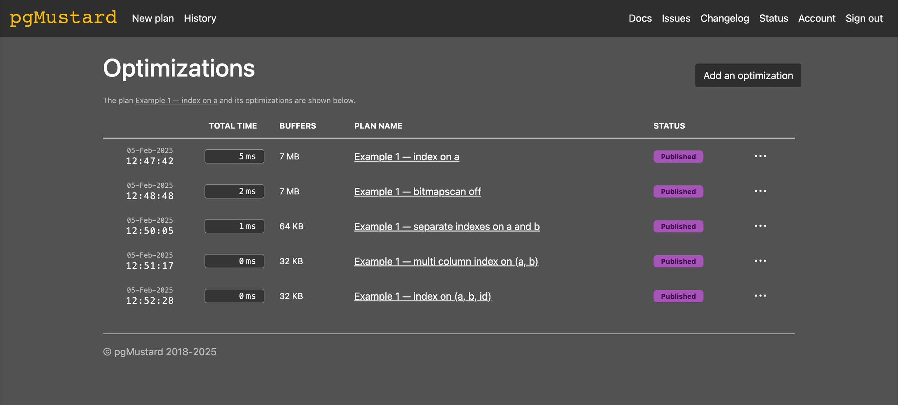

# 索引扫描并不意味着高效

我经常看到人们在查看执行计划时忽略的一个问题：他们的所有扫描都涉及到索引，因此他们认为查询可能已经尽可能快（或高效）了。

大部分人都知道，如果[顺序扫描](https://www.pgmustard.com/docs/explain/seq-scan)中有[大量的行被过滤掉](https://www.pgmustard.com/docs/explain/rows-removed-by-filter)，则表明索引可以提供帮助。但是索引加快速度的原因同样适用于具有过滤更多行的其他扫描，其中过滤行更多的索引可以加快速度！虽然我们经常会看到索引过滤器显示 `Rows Removed by Filter`，但遗憾的是，有些情况 `EXPLAIN` 并不会报告（我们稍后会讲到）。

在本文中，我们将通过几个示例以及一些需要注意的事项来说明如何加快速度。

值得注意的是，还有其他方法可以进一步优化索引的使用。我们还通过 pgMustard 中的 `Index Efficiency` 提示重点介绍了一个这样的例子，即通过[索引重新检查删除了大量行](https://www.pgmustard.com/docs/explain/rows-removed-by-index-recheck)。但这篇文章已经够长了，所以我们改天再讨论。

<!-- more -->

## 留意过滤器删除的行

让我们创建一个简单的示例表来演示：

``` sql
CREATE TABLE example (
   id bigint GENERATED ALWAYS AS IDENTITY PRIMARY KEY,
   a smallint NOT NULL,
   b smallint NOT NULL);

INSERT INTO example (a, b)
   SELECT random (1, 1_000), random (1, 1_000) 
   FROM generate_series(1, 1_000_000);

VACUUM ANALYZE example;

SELECT * FROM example LIMIT 5;
```
``` title="输出"
 id |  a  |  b  
----+-----+-----
  1 | 803 | 627
  2 | 978 | 702
  3 |  15 | 506
  4 | 966 | 335
  5 | 247 | 172
(5 rows)
```
现在，我们总共有一百万行，其中一个是整数主键，还有两个额外的列 `a` 和 `b`，它们包含 1 到 1000 之间的随机整数。

让我们看一下几个索引选项，用于优化基于 `a` 和 `b` 进行过滤的简单查询：

``` sql
CREATE INDEX example_a_idx ON example (a);

EXPLAIN (ANALYZE, BUFFERS, VERBOSE, SETTINGS) 
SELECT id FROM example WHERE a = 42 AND b = 42;
```
``` title="输出"
                                                         QUERY PLAN                                                         
----------------------------------------------------------------------------------------------------------------------------
 Bitmap Heap Scan on public.example  (cost=11.86..2542.34 rows=1 width=8) (actual time=4.024..4.489 rows=1 loops=1)
   Output: id
   Recheck Cond: (example.a = 42)
   Filter: (example.b = 42)
   Rows Removed by Filter: 1016
   Heap Blocks: exact=925
   Buffers: shared hit=928
   ->  Bitmap Index Scan on example_a_idx  (cost=0.00..11.86 rows=991 width=0) (actual time=0.407..0.407 rows=1017 loops=1)
         Index Cond: (example.a = 42)
         Buffers: shared hit=3
 Planning Time: 0.143 ms
 Execution Time: 4.538 ms
```

通过列 `a` 上的索引，PostgreSQL 选择执行位图索引扫描来查找 `a = 42` 的行，然后对包含这些行的页面进行位图堆扫描，仅筛选出 `b` 也等于 `42` 的行。

虽然这总共只花费了大约 5 毫秒。我们可以看到过滤器删除了 1016 行，但最终只返回了 1 行——效率不高！

另一个线索（感谢 `Buffers` 行）是 PostgreSQL 总共必须读取 928 个块（约 7MB），其中除 3 个块外，其余均来自 `Bitmap Heap Scan` 阶段。

简单的索引扫描会比这个位图扫描更好吗？

让我们尝试阻止位图扫描，然后再次运行查询：

``` sql
SET enable_bitmapscan = off;

EXPLAIN (ANALYZE, BUFFERS, VERBOSE, SETTINGS) 
SELECT id FROM example WHERE a = 42 AND b = 42;
```
``` title="输出"
                                                           QUERY PLAN                                                            
---------------------------------------------------------------------------------------------------------------------------------
 Index Scan using example_a_idx on public.example  (cost=0.42..3655.99 rows=1 width=8) (actual time=1.438..1.682 rows=1 loops=1)
   Output: id
   Index Cond: (example.a = 42)
   Filter: (example.b = 42)
   Rows Removed by Filter: 1016
   Buffers: shared hit=928
 Settings: enable_bitmapscan = 'off'
 Planning Time: 0.144 ms
 Execution Time: 1.706 ms
```

这更快，大约 2 毫秒，但我们仍然可以看到那 1016 行被过滤器删除。`Buffers` 还显示我们仍然需要读取 928 个块。所以这两者都是一个很好的迹象，表明我们可以做得更好...

如果我们在 `b` 也有一个索引会怎么样？

``` sql
RESET enable_bitmapscan;

CREATE INDEX example_b_idx ON example (b);

EXPLAIN (ANALYZE, BUFFERS, VERBOSE, SETTINGS) 
SELECT id FROM example WHERE a = 42 AND b = 42;
```
``` title="输出"
                                                            QUERY PLAN                                                            
----------------------------------------------------------------------------------------------------------------------------------
 Bitmap Heap Scan on public.example  (cost=24.00..28.01 rows=1 width=8) (actual time=0.674..0.676 rows=1 loops=1)
   Output: id
   Recheck Cond: ((example.a = 42) AND (example.b = 42))
   Heap Blocks: exact=1
   Buffers: shared hit=8
   ->  BitmapAnd  (cost=24.00..24.00 rows=1 width=0) (actual time=0.652..0.653 rows=0 loops=1)
         Buffers: shared hit=7
         ->  Bitmap Index Scan on example_a_idx  (cost=0.00..11.86 rows=991 width=0) (actual time=0.259..0.259 rows=1017 loops=1)
               Index Cond: (example.a = 42)
               Buffers: shared hit=3
         ->  Bitmap Index Scan on example_b_idx  (cost=0.00..11.89 rows=995 width=0) (actual time=0.208..0.208 rows=991 loops=1)
               Index Cond: (example.b = 42)
               Buffers: shared hit=4
 Planning Time: 0.143 ms
 Execution Time: 0.706 ms
```

现在，时间已降至 1 毫秒以下，但关键的是 `Buffers` 数量大幅减少（8 个块，即 64KB）！这一次，PostgreSQL 扫描了每个索引（单独），然后对每个结果中的匹配行进行 AND 运算，以查找同时匹配两个条件的行。

虽然不再有明确的 `Rows Removed by Filter` 字段，但那些位图索引扫描仍然会读取一些未返回的索引条目。让我们看看是否可以做得更好，通过在 `(a, b)` 上尝试复合索引，将我们需要的条目在单个索引结构中彼此相邻地排序：

``` sql
CREATE INDEX example_a_b_idx ON example (a, b);

EXPLAIN (ANALYZE, BUFFERS, VERBOSE, SETTINGS) 
SELECT id FROM example WHERE a = 42 AND b = 42;
```
``` title="输出"
                                                           QUERY PLAN                                                           
--------------------------------------------------------------------------------------------------------------------------------
 Index Scan using example_a_b_idx on public.example  (cost=0.42..8.45 rows=1 width=8) (actual time=0.032..0.033 rows=1 loops=1)
   Output: id
   Index Cond: ((example.a = 42) AND (example.b = 42))
   Buffers: shared hit=4
 Planning Time: 0.160 ms
 Execution Time: 0.058 ms
```

我们总共减少了 4 次缓冲区命中，而且速度快了很多！最后一次尝试，为了好玩，让我们尝试在 (a, b, id) 上使用复合索引，以尝试仅进行索引扫描：

``` sql
CREATE INDEX example_a_b_id_idx ON example (a, b, id);

EXPLAIN (ANALYZE, BUFFERS, VERBOSE, SETTINGS) 
SELECT id FROM example WHERE a = 42 AND b = 42;
```
``` title="输出"
                                                               QUERY PLAN                                                               
----------------------------------------------------------------------------------------------------------------------------------------
 Index Only Scan using example_a_b_id_idx on public.example  (cost=0.42..4.44 rows=1 width=8) (actual time=0.029..0.031 rows=1 loops=1)
   Output: id
   Index Cond: ((example.a = 42) AND (example.b = 42))
   Heap Fetches: 0
   Buffers: shared hit=4
 Planning Time: 0.115 ms
 Execution Time: 0.046 ms
```

尽管避免了访问堆，但我们仍然总共读取了 4 个块（可能是因为索引稍大一些），因此查询速度并没有快多少。有趣！

从第一个查询计划（已经非常快并且使用索引）开始，我们仍然设法在执行时间和读取的块数量上实现了几个数量级的改进，主要是通过尝试获取我们需要的准确数据而无需读取和过滤行。

因此，总结一下，无论扫描类型如何，如果 PostgreSQL 需要读取比其需要更多的数据，而又不得不将其过滤掉，那么可能存在一种更有效的方法。留意被过滤器删除的行。

作为参考，我已经在 pgMustard 中审查并发布了[这五个查询计划](https://app.pgmustard.com/#/optimizations/8712d769-23e6-4d32-8468-92a20a266ad5)。



上述原始查询计划的总时间和总缓冲区，以及 4 次优化尝试。

## 留意循环

重要的是，`Rows Removed by Filter` 字段是每个循环的平均值，四舍五入到最接近的整数。在上面的例子中，我们总是有 `loops=1`，所以这并不相关，但在其他查询中，特别是涉及嵌套循环的查询中，它可能是一个重要的因素。

假设您看到 `actual [...] rows=1 loops=10000` 和 `Rows Removed by Filter: 5`。这意味着大约有 10k 行被返回，但为了实现这一点还需要读取和过滤另外 50k 行。5 比 1 已经不是一个很好的效率比，但是当乘以 10k 时，节省时间的潜力就变得非常有趣！

因此，如果您只看到通过过滤器删除的行数很少，但循环数很高，那么可能仍然有很大的改进机会（通过使用更好的索引）。

## 索引列顺序非常重要

目前，截止版本 17，PostgreSQL 依然没有实现 `Index Skip Scan` 扫描（尽管已经有[这方面的尝试](https://www.postgresql.org/message-id/flat/CAH2-Wzmn1YsLzOGgjAQZdn1STSG_y8qP__vggTaPAYXJP%2BG4bw%40mail.gmail.com)）。因此，btree 索引中的列顺序对于性能极为重要。

### 即使仅对单个列进行过滤

一个常见的例子是 `(a, b)` 上的索引不能有效地用于仅对 `b` 进行过滤的查询。为了演示，让我们删除仅在 `b` 上创建的索引，并阻止序列扫描：

``` sql
DROP INDEX example_b_idx;

SET enable_seqscan = off;

EXPLAIN (ANALYZE, BUFFERS, VERBOSE, SETTINGS) 
SELECT id FROM example WHERE b = 42;
```
``` title="输出"
                                                            QUERY PLAN                                                            
----------------------------------------------------------------------------------------------------------------------------------
 Bitmap Heap Scan on public.example  (cost=17132.67..19669.35 rows=995 width=8) (actual time=38.616..39.629 rows=991 loops=1)
   Output: id
   Recheck Cond: (example.b = 42)
   Heap Blocks: exact=909
   Buffers: shared hit=3308
   ->  Bitmap Index Scan on example_a_b_idx  (cost=0.00..17132.42 rows=995 width=0) (actual time=38.443..38.443 rows=991 loops=1)
         Index Cond: (example.b = 42)
         Buffers: shared hit=2399
 Settings: enable_seqscan = 'off'
 Planning Time: 0.304 ms
 Execution Time: 39.736 ms
```

它确实使用了我们的 `example_a_b_idx` 索引，但耗时将近 40 毫秒，总共读取了 3308 个块（约 26MB）。

让我们尝试添加一个顺序为 `(b, a)` 的索引，以查看其对于相同查询的效率如何：

``` sql
RESET enable_seqscan;

CREATE INDEX example_b_a_idx ON example (b, a);

EXPLAIN (ANALYZE, BUFFERS, VERBOSE, SETTINGS) 
SELECT id FROM example WHERE b = 42;
```
``` title="输出"
                                                         QUERY PLAN                                                          
-----------------------------------------------------------------------------------------------------------------------------
 Bitmap Heap Scan on public.example  (cost=20.14..2556.81 rows=995 width=8) (actual time=0.649..3.212 rows=991 loops=1)
   Output: id
   Recheck Cond: (example.b = 42)
   Heap Blocks: exact=909
   Buffers: shared hit=915
   ->  Bitmap Index Scan on example_b_a_idx  (cost=0.00..19.89 rows=995 width=0) (actual time=0.393..0.394 rows=991 loops=1)
         Index Cond: (example.b = 42)
         Buffers: shared hit=6
 Planning Time: 0.232 ms
 Execution Time: 3.406 ms
```

这花费了不到 4 毫秒的时间，总共读取了 915 个块（约 7MB）——好多了！

遗憾的是，PostgreSQL 没有在上面效率较低的计划中报告任何 `Rows Removed by Filter`，尽管这实际上是位图索引扫描期间发生的情况。我们目前也无法从 `Index Cond` 中判断它是否被有效使用，但执行时间、成本和缓冲区都提供了很好的线索。

### 根据多列进行筛选时的列顺序

对于根据索引中的所有条件进行筛选的查询，列顺序也非常重要。

一个很好的例子是，如果其中一个过滤器是范围条件。为了演示，让我们尝试一个查询，我们的新索引 `(b, a)` 应该可以很好地满足该查询：

``` sql
EXPLAIN (ANALYZE, BUFFERS, VERBOSE, SETTINGS) 
SELECT id FROM example WHERE b = 42 AND a < 100;
```
``` title="输出"
                                                        QUERY PLAN                                                         
---------------------------------------------------------------------------------------------------------------------------
 Bitmap Heap Scan on public.example  (cost=5.44..362.73 rows=99 width=8) (actual time=0.128..0.502 rows=116 loops=1)
   Output: id
   Recheck Cond: ((example.b = 42) AND (example.a < 100))
   Heap Blocks: exact=115
   Buffers: shared hit=118
   ->  Bitmap Index Scan on example_b_a_idx  (cost=0.00..5.42 rows=99 width=0) (actual time=0.073..0.074 rows=116 loops=1)
         Index Cond: ((example.b = 42) AND (example.a < 100))
         Buffers: shared hit=3
 Settings: enable_seqscan = 'off'
 Planning Time: 0.304 ms
 Execution Time: 0.577 ms
```

尽管它返回了 116 行，但它在 1 毫秒内运行并读取了 118 个块（约 1MB）。

让我们删除 `(b, a)` 上的索引并阻止顺序扫描，以查看 `(a, b)` 上的索引如何有效地处理相同查询：

``` sql
DROP INDEX example_b_a_idx;

EXPLAIN (ANALYZE, BUFFERS, VERBOSE, SETTINGS) 
SELECT id FROM example WHERE b = 42 AND a < 100;
```
``` title="输出"
                                                          QUERY PLAN                                                          
------------------------------------------------------------------------------------------------------------------------------
 Bitmap Heap Scan on public.example  (cost=1955.74..2313.03 rows=99 width=8) (actual time=4.721..5.123 rows=116 loops=1)
   Output: id
   Recheck Cond: ((example.a < 100) AND (example.b = 42))
   Heap Blocks: exact=115
   Buffers: shared hit=355
   ->  Bitmap Index Scan on example_a_b_idx  (cost=0.00..1955.71 rows=99 width=0) (actual time=4.623..4.624 rows=116 loops=1)
         Index Cond: ((example.a < 100) AND (example.b = 42))
         Buffers: shared hit=240
 Planning Time: 0.305 ms
 Execution Time: 5.200 ms
```

这花费了 5 毫秒多一点的时间，并读取了 355 个块（约 3MB）来满足相同的查询。

根据数据分布和其他因素（例如 `LIMIT` 子句），这种差异可能会变得更加极端，因此密切关注索引中列的顺序非常重要！

向 `EXPLAIN` 添加更多信息以帮助发现这些问题是 PostgreSQL 社区[积极开展](https://commitfest.postgresql.org/48/5063/)的另一个领域，因此我希望它在不久的将来会得到改进。Query Doctor 团队在最近有关 [EXPLAIN 怪癖](https://querydoctor.com/blog/postgresql-explain-quirks)的文章中很好地介绍了这个特定主题。

## 总结

虽然我们还没有讨论索引扫描对于给定查询效率低下的所有方式，但我们已经涵盖了我经常看到的最常见的情况。

我至少希望您现在能够对查询计划中需要注意的事项有更多的想法，以帮助诊断这些类型的低效率：

1. 过滤器删除了大量行，即使在索引扫描类型中也是如此
2. 循环次数高，乘以过滤器删除的行数
3. 缓冲区数量较多，尤其是与返回的行相比
4. 索引中列的顺序，以及是否适合查询

但是，如果您只从这篇博文中学到一件事，我希望那就是，仅仅因为您看到了 `Index Scan` 这个词，并不意味着扫描速度尽可能快！

<hr>
> 作者：Michael Christofides<br>
> 原文：[https://www.pgmustard.com/blog/index-scan-doesnt-mean-its-fast](https://www.pgmustard.com/blog/index-scan-doesnt-mean-its-fast)

