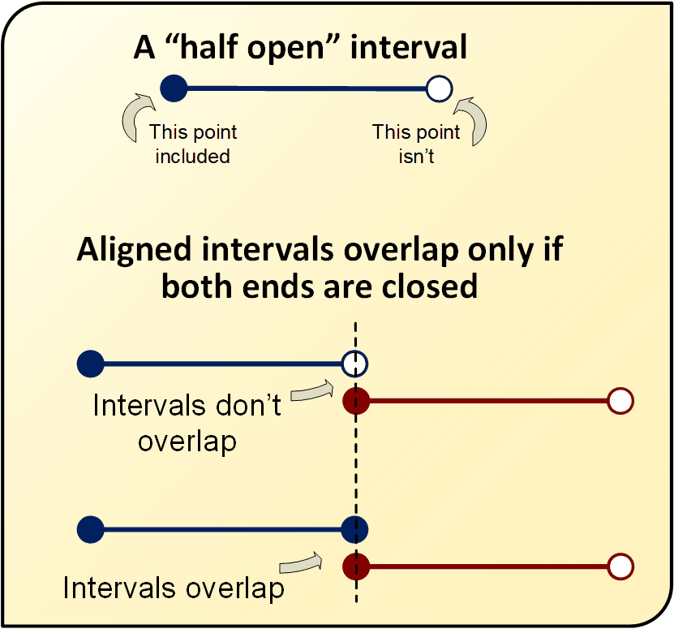
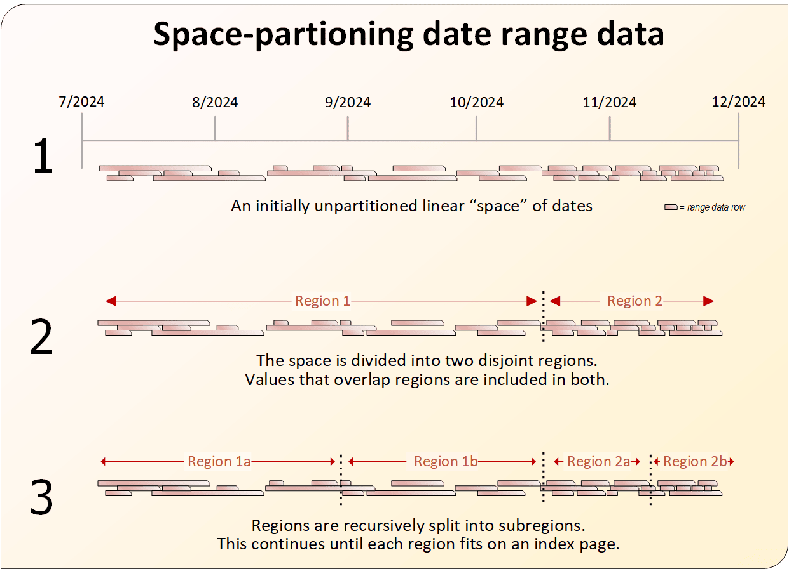

# PostgreSQL 中子集的重叠范围

在[本系列的第一部分](solving-the-overlap-query-problem-in-postgresql.md)中，我们探讨了重叠查询及其伴随的问题，以及提高其性能的方法。最后，我们根据时间戳范围定义了一个重叠查询，这使我们能够使用一种称为 GiST 的新索引类型，从而大大加快了这些类型的查询速度。在第二部分中，我们将进一步提高重叠查询性能，但首先让我们介绍一下范围类型的一些其他特性。

<!-- more -->

## 适合所有场合

我们的第一部分查询使用了以下 `WHERE` 子句：

``` sql
WHERE tsrange(o.start_time, o.end_time) && tsrange(p.enter, p.leave)
```

`tsrange()` 函数返回时间戳范围。但重叠查询不仅限于时间戳；它们也可以由整数和浮点值构建。想象一个跟踪某种商品的最低和最高价格的套利数据库。如果您希望找到所有为五花肉支付 1.35 美元到 1.65 美元之间的顾客，您可以使用 `numrange()` 函数构建一个数字范围；查询 `WHERE` 子句将是：

``` sql
WHERE numrange(min_price, max_price) && numrange(1.35, 1.65)
```

对于 `integer` 和 `bigint` 范围，有函数 `int4range()` 和 `int8range()`。可以使用 `daterange()` 构建仅限日期的时间间隔（不含时间），甚至还有一个 `tstzrange()` 函数，它会考虑涉及的时间戳值的时区。（但请记住：与使用“带时区”定义的数据库列一样，实际时区不会被存储，只是一个标志，表示时间戳应该在客户端转换为本地时间。）

## 防止表行重叠

重叠查询的常见需求是防止包含重叠时间段的行插入到表中，类似于 `UNIQUE` 限制。例如，会议室预订列表不允许同时预订，或者播客时间表只允许在任何给定时间播放一集。此类业务逻辑可以使用触发器或存储过程在数据库中完成。但使用 GiST 则是一种更简单的方法。

为了说明这一点，请考虑即将播出的播客剧集的基本表，其中包含剧集标识符和两个时间戳，指示计划的开始和停止时间。为了防止任何两行在时间上重叠，请使用 `exclude` 运算符，如下所示：

``` sql
CREATE TABLE episodes (
 episode_id       INTEGER NOT NULL,
 planned_start  TIMESTAMP(0) WITHOUT TIME ZONE NOT NULL,
 planned_end   TIMESTAMP(0) WITHOUT TIME ZONE NOT NULL,
 EXCLUDE USING gist (tsrange(planned_start, planned_end) WITH &&)
);
```

我们可以通过尝试插入两行相互冲突的行来验证这一点：

``` sql
INSERT INTO episodes 
VALUES (1, '11/5/2024 08:00 am', '11/5/2024 09:30 am');
INSERT INTO episodes 
VALUES (2, '11/5/2024 09:00 am', '11/5/2024 11:00 am');
```

由于第 2 集在第 1 集结束之前开始，第二次插入失败，错误如下：

```
ERROR: conflicting key value violates exclusion constraint …
```

与 `UNIQUE` 约束一样，`EXCLUDE` 创建底层索引来支持约束，这意味着您不需要在表定义后面添加单独的索引创建语句。

!!! note "注意"

	实际业务场景可能需要额外的标准来确定重叠错误。例如，酒店预订系统需要房间号，或者上面的播客示例可能支持多个频道，每个频道同时广播。这可以在 EXCLUDE 语句中完成，但它需要向 GiST 添加 B 树支持，如下所述。
	
## 修改范围语句

在[第一部分](solving-the-overlap-query-problem-in-postgresql.md)中，我们注意到标准 SQL 语义将范围定义为“半开放”——范围的起点是包含在范围内，但终点是不包含在范围内（Joe Celko 在[本文](https://www.red-gate.com/simple-talk/databases/sql-server/t-sql-programming-sql-server/between-the-two-of-us/)中提到了半高开、半低开的理念）。这种存储范围的方法简化了存储，但往往会使重叠计算复杂化：下午 5 点结束的间隔不会与在同一时间开始的间隔重叠（尽管它会与早一毫秒开始的间隔重叠）。所有范围构造函数（`tsrange()`、`daterange()` 等）都遵循相同的语义。

您可以轻松地覆盖此行为。构造函数接受第三个参数：一个两字符的字符串，表示每个端点的状态：方括号表示包含；圆括号表示不包含。

下表列出了各种可能性：

| 参数 | 行为                       |
|------|----------------------------|
| `()` | 两个端点均不包含           |
| `[]` | 两个端点均包含             |
| `[)` | 包含起点，不包含终点，默认 |
| `(]` | 不包含起点，包含终点       |

为了说明，让我们回到播客剧集的示例。在其中，我们使用默认的“半开放”语义创建了“无重叠”约束。这使得新剧集的开始时间与前一剧集的结束时间完全相同。例如，即使一集的结束与另一集的开始相匹配，以下两行也不重叠：

``` sql
INSERT INTO episodes 
VALUES (3, '11/6/2024 08:00 am', '11/6/2024 09:00 am');
INSERT INTO episodes 
VALUES (4, '11/6/2024 09:00 am', '11/6/2024 10:00 am');
```

但是在创建约束时，如果我们指示 `tsrange()` 函数包含两个端点，如下所示：

``` sql
EXCLUDE USING gist (tsrange(planned_start, planned_end, '[]')
                    WITH &&)
```

由于该限制，第二次 `INSERT` 将失败。



## 提升绩效：GiST 的不同版本

现在让我们回到我们的重点：提高性能。GiST 索引类型是通用重叠查询的不错选择。但通常，时间序列数据在一系列日期内分布相当均匀，没有大量重叠值。一个很好的例子是我们第一部分中的样本数据：它随机分布在 20 年的间隔内，并且任何给定的行仅与表中其他行的一小部分重叠。对于这样的数据，空间分区的 GiST 索引可以产生更好的性能。PostgreSQL 也支持这种类型的索引 - 称为 SP-GiST。

创建 SP-GiST 索引的语句与常规 GiST 几乎相同。使用第一部分中的 `patrons` 示例表，我们创建了一个正常的 GiST 索引，如下所示：

``` sql
CREATE INDEX ON PATRONS USING gist(tsrange(enter, leave));
```

对于 SP-GiST，我们将索引类型更改为 `spgist` 并指定一个操作符类：

``` sql
CREATE INDEX ON USING spgist(tsrange(enter, leave) range_ops);
```

这里，内置的 `range_ops` 运算符（不出所料）意味着我们要对索引执行范围操作。



我们可以期望空间分区版本的 GiST 的性能提高多少？在我们的第一部分测试数据中，用 SP-GiST 替换旧的 GiST 索引将查询时间从 5.2 秒减少到 3.7 秒——提升了 30%。在最佳情况下（例如不允许重叠行的表），预期增幅可能高达 50%。但在重叠程度较高的数据集上，SP-GiST 的表现可能会更差。用您自己的数据进行测试！

## 为 GiST 添加 B-树 支持

通常，重叠查询具有超出范围本身的标准。餐厅预订不会与其他预订重叠，除非是同一张桌子；如果病人不同，医院可以在同一时间段安排多次就诊，等等。

回到第一部分中的示例代码，其中使用了一个博物馆的顾客和安全中断的示例：如果数据包括多个站点会怎样？现在，只有当顾客和停电发生在同一地点时，才会出现“重叠”。这会如何改变情况？

让我们重新创建表，这次添加一个 `location_id` 外键：

``` sql
CREATE TABLE patrons (
    patron_id INT NOT NULL GENERATED ALWAYS AS IDENTITY,
    location_id INT NOT NULL,
    enter Timestamp(0) NOT NULL,
    leave Timestamp(0) NOT NULL
);
CREATE TABLE outages (
    location_id INT NOT NULL,
    start_time Timestamp(0) NOT NULL,
    end_time Timestamp(0) NOT NULL
);
--Note, the code to load these tables is located in the Appendix
```

我们对重叠值的查询现在有一个连接条件，而不是 `CROSS JOIN`：

``` sql
SELECT * FROM patrons p
INNER JOIN outages o 
          ON p.location_id = o.location_id
WHERE tsrange(o.start_time, o.end_time) && tsrange(p.enter, p.leave);
```

由于这是随机生成的数据，您可能会得到更多或更少的行，因此您的性能可能会有所不同。

如果您使用我们在第一部分中创建的相同 GiST 索引运行此查询，则性能将会从糟糕到极度糟糕，具体取决于存在多少个不同的位置值。我们假设有 20 个可能的位置，看看是否可以再次提高性能。

对于像这样的双条件查询，我们的本能是多列索引，每个条件一个。并且，由于时间戳范围比 `location_id` 更具体（从技术角度来说，它的基数更高），它应该是第一个索引的列。这促使我们尝试这个命令：

``` sql
CREATE INDEX ON patrons 
USING GIST(tsrange(enter,leave), location_id); 
```

我们的直觉是正确的，但是在 PostgreSQL 的默认配置下，该语句显示错误。

```
ERROR: data type integer has no default operator class for access method "gist"
```

尽管 GiST 索引功能强大，但它不支持简单的操作，例如字符串、日期或（在本例中）整数的直接比较。幸运的是，PostgreSQL 附带了一个扩展，可将 B-树类型的操作添加到 GiST。我们需要做的就是安装它：

``` sql
CREATE EXTENSION btree_gist;
```

现在我们可以毫无错误地创建上述索引，并且在发生中断时创建类似的索引：

``` sql
CREATE INDEX ON outages 
    USING GIST(tsrange(start_time, end_time), location_id);
```

这不仅恢复了第一部分中缺少 `location_id` 的查询的性能：

``` sql
SELECT *
FROM patrons p
        CROSS JOIN outages o
WHERE tsrange(o.start_time, o.end_time) 
             && tsrange(p.enter, p.leave);
```

但是稍微好一些（在我的测试系统上为 4.9 秒，同样使用随机生成的数据，如您在完整脚本中所看到的，用于填充测试表、创建索引并执行下面附录一中的查询。

!!! note "注意"

	我们的 `location_id` 是一个低基数值（只有 20 个可能的值，因为我使用 `TRUNC(RANDOM()*20)`来生成它们）。
	
	如果有更多位置（例如 100,000+），则索引可能更适合以 `location_id` 作为第一列；但在这种情况下，性能可能不会比默认的 B-树索引更好，因为这些索引就是为此场景设计的。
	
	**用您自己的数据进行测试！**

## 附录一：示例 SQL 脚本

以下是一些可用于本文中示例代码的有用脚本：

``` sql
-- create tables
CREATE TABLE patrons (
        patron_id INT NOT NULL GENERATED ALWAYS AS IDENTITY,
        location_id INT NOT NULL,
        enter Timestamp(0) NOT NULL,
        leave Timestamp(0) NOT NULL
);
CREATE TABLE outages (
        location_id INT NOT NULL,
        start_time Timestamp(0) NOT NULL,
        end_time Timestamp(0) NOT NULL);
```

为了完成某些示例，特别是那些时间很重要的示例，您可以使用此脚本来生成数据。

``` sql
-- create 1M random patrons and 250K random outages
INSERT INTO patrons (location_id, enter,leave) (
SELECT TRUNC(RANDOM()*20), r, 
       r + '1 minute'::INTERVAL * ROUND(RANDOM()+1 * 60) 
FROM (SELECT NOW() - '1 minute'::INTERVAL * 
                ROUND(RANDOM() * 15768000) AS r 
      FROM generate_series(1,1000000)) AS sub);
INSERT INTO outages (
SELECT TRUNC(RANDOM()*20), r, 
       r + '1 minute'::INTERVAL * ROUND(RANDOM() * 20) 
FROM (SELECT NOW() - '1 minute'::INTERVAL *
                    ROUND(RANDOM() * 15768000) AS r 
      FROM generate_series(1,250000)) AS sub);
-- delete malformed entries from randomly generated data.
DELETE FROM patrons WHERE enter >= leave;
DELETE FROM outages WHERE start_time >= end_time;
```

下面将创建本文中提到的索引。它们需要 `btree_gist` 扩展才能执行。

``` sql
-- create indexes
CREATE INDEX ON patrons 
  USING gist(tsrange(enter,leave), location_id);
CREATE INDEX ON outages 
  USING gist(tsrange(start_time, end_time), location_id);
-- run test query
EXPLAIN ANALYZE 
SELECT * 
FROM patrons p
INNER JOIN outages o ON p.location_id = o.location_id
WHERE tsrange(o.start_time, o.end_time) 
             && tsrange(p.enter, p.leave);
```

> 作者：Lee Asher<br>
> 原文：[https://www.red-gate.com/simple-talk/databases/postgresql/overlapping-ranges-in-subsets-in-postgresql/](https://www.red-gate.com/simple-talk/databases/postgresql/overlapping-ranges-in-subsets-in-postgresql/)


