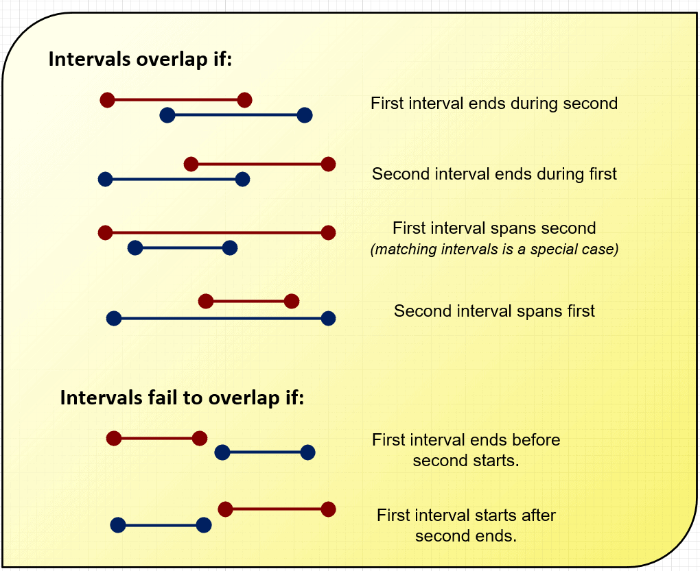
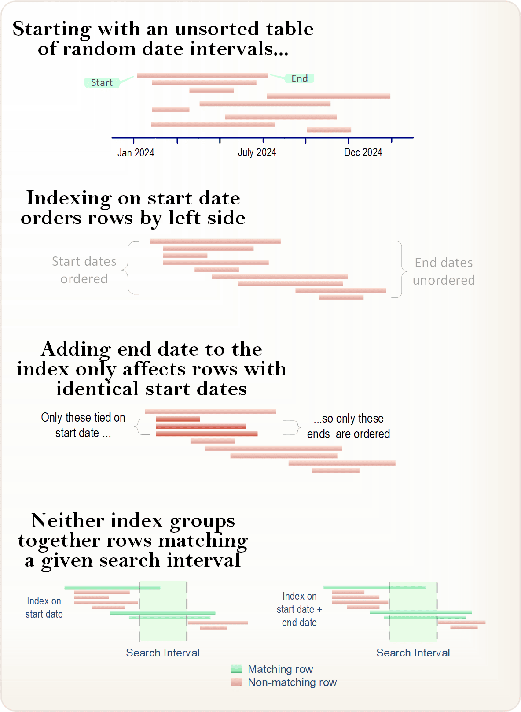

# 解决 PostgreSQL 中的重叠查询问题

范围查询是 SQL 中非常常见的任务：选择属于某个指定范围内的日期、数字甚至文本值。例如：3 月份的所有贷款申请，或 50 美元至 500 美元之间的所有销售交易。SQL 开发人员通常擅长编写此类查询并对其进行索引以确保其性能良好。

但当需求稍有变化时——比较两个值的范围以找出它们的重叠之处——情况突然就完全不同了。这些所谓的“重叠查询”比表面上看起来更棘手。

<!-- more -->

## 重叠查询

最常见的重叠查询涉及时间（日期和时间）范围，称为间隔（`intervals`）。例如，想象一下对医院病人的查询。如果您希望查找八月份首次入院的所有患者，这是一个简单的范围查询。但是如果您希望找到住院时间（另一个日期间隔）至少部分位于八月间隔的所有患者，这是一个重叠查询。虽然编写这样的查询并不难，但编写出性能良好的查询却很困难。让我们看看为什么。

### 用例场景

让我们研究一个涉及重叠查询的实际问题。大型博物馆的数据库跟踪所有来访顾客进出建筑物的时间。它还在其视频安全系统中维护所有中断的时间。在一连串轻微盗窃事件之后，安全主管要求提供一份在一次或多次安全中断期间在场的所有顾客的名单。显然，我们有一个日期时间范围，即顾客的停留时间，必须将其与另一个日期时间范围（表示安全中断的间隔）进行比较。目标是找到所有重叠的实例。

### 数据库

顾客表（`patrons`）包含表示访问持续时间的初始和最终时间戳，以及表示关联顾客的 ID。中断表（`outages`）定义了每次中断的开始和结束时间戳。为了简单起见，我们不包括其他列。

``` sql
CREATE TABLE patrons (
      patron_id  INT  generated always as identity NOT NULL,
      enter      Timestamp(0) NOT NULL,
      leave      Timestamp(0) NOT NULL
);
CREATE TABLE outages (
      location_id INT generated always as identity NOT NULL,
      start_time  Timestamp(0) NOT NULL,
      end_time   Timestamp(0) NOT NULL
);
```

为了在大型数据集上测试性能，我们将使用 20 年的随机数据填充这两个表。（填充表格的脚本位于文章末尾结论部分后面的附录部分。）

在 SQL 中，比较间隔的规范方法是使用 `OVERLAPS` 运算符。要查找所有重叠的情况，只需将每个表中的日期分成间隔，然后与此运算符进行比较：

``` sql
SELECT * 
FROM patrons p
       CROSS JOIN outages o
WHERE (p.enter, p.leave) OVERLAPS (o.start_time, o.end_time);
```

此查询可以工作--至少它将返回适当的行--但它非常慢。（在我的测试系统上（Windows 11 和 PostgreSQL 16，测试机器是 AMD 5700x CPU、2GB SSD），至少需要 3 分钟）。首次尝试优化查询可能会导致您在中断开始和结束时间上创建复合索引，并在订阅会员上创建类似的索引：

``` sql
CREATE INDEX ON outages USING BTREE(start_time, end_time);
CREATE INDEX ON patrons USING BTREE(enter, leave);
```

这并没有任何帮助：查询同样缓慢。经过一番研究发现，`OVERLAPS` 运算符不支持索引。因此，我们改为明确指定比较。

第一次尝试这样的查询时，您可能会在一张纸上画线，并看到两个间隔可以重叠的四种不同方式（见下图）。这使得查询相当复杂，但我们可以用一些小技巧来简化它。只有两种方式可以让区间不重叠。如果我们编写不重叠的查询，然后用 `NOT` 进行反转，我们就会得到所需的结果。



例如，用于查找 `interval1` 和 `interval2` 所有不重叠情况的 `WHERE` 子句如下所示：

``` sql
WHERE interval1.start > interval2.end
      OR interval2.start > interval1.end
```

如果我们使用 `NOT` 反转整个查询，我们将得到所有重叠的情况

``` sql
WHERE NOT (date1.start > date2.end 
           OR date2.start > date1.end)
```

这还可简化（使用布尔逻辑规则）为：

``` sql
WHERE date1.start <= date2.end 
      AND date2.start <= date1.end)
```

（注意：编写查询是为了符合时间间隔的 SQL 标准，该标准规定，如果一个间隔的开始时间正好在另一个间隔的结束时间，则会发生重叠。这意味着将包含恰好重叠 0.00 秒的值。如果您希望要求最少的重叠量，请相应地调整您的查询）

那么，我们取得了什么成就？好吧，显式形式稍微快一些（26.1 秒），但实际生产表可能比这些样本大几个数量级。我们期望这样的查询能够非常快。查看访问计划，我们看到 PostgreSQL 将表扫描与索引扫描相结合 - 没有使用索引查找。

在最后的绝望中，您可能会将复合索引分成两个单独的索引：每个时间戳一个。这不仅没有帮助，而且（如果删除原始索引）它会和原始 `OVERLAPS()` 形式一样慢。哪里出了问题？

### B-树的问题

顾名思义，B-树索引包含索引列上的值的分支结构；遍历树可以找到特定值或任何连续的值范围。对于复合（多列）索引，仅当第一列具有多个相等值时，第二列才会影响排序：第二列充当“决胜局”的作用。第三列仅当第二列出现平局时才起作用，依此类推。这在视觉上更容易理解。参见下图：



请注意，与简单的单列索引相比，我们的复合索引（开始日期+结束日期）对行排序的影响很小。而且，这两种方法都不能让我们快速找到所有重叠值。与我们的查询范围重叠的行（以绿色显示）没有按顺序排列，因此我们的索引没有帮助。必须扫描整个表。

当该间隔是一个固定值时，情况已经够糟糕了，但是当间隔来自另一个表（或原始表的自连接）时，这意味着表 A 中的每一行都必须与表 B 中的每一行匹配。从技术角度来说，这是*二次性能（quadratic performance）*——行数增加一倍意味着查询必须完成四倍的工作。在非常大的表上，这样的查询甚至会拖垮最强大的服务器。

### 廉价伎俩

在我们研究更复杂的方法之前，通常有一种简单的方法来“破解”重叠查询。其想法是为查询优化器（QO, Query Optimizer）提供我们拥有但它不具备的信息。在我们的示例中，表跨越多年的时间戳值，但任何单个事件都要短得多。

如果我们可以确定任一类型事件的最大持续时间并将该信息传递给查询优化器，它就可以扫描索引的一小部分。例如，在我们的数据中，没有顾客的访问时间超过 4 小时。我们可以按照以下方式将此信息添加到我们的查询中：

``` sql
SELECT * 
FROM patrons p
       CROSS JOIN outages o
WHERE p.enter <= o.end_time 
  AND p.enter >= o.end_time - '1 hour'::INTERVAL*4 --<<
  AND p.leave >= o.start_time;
```

新的子句（后缀为 `-–<<`）表示 `p.enter` 现在既有最小值，也有最大值。这会将语句转换为（索引可服务的）范围查询。

假设您仍然有此列的索引，查询时间的效果将非常显著：从 26 秒缩短到 0.1 秒。哇！突然我们就有了一个实用的查询。

我们本可以对停电采取相同的措施，而不是为顾客设置最大范围。或者更好的是，同时使用两个表。查询优化器不会同时使用两个表，但它会使用它认为最高效的一个。

这种技术的最大优点是它允许您使用可能已经拥有的索引。但是，请小心！如果任何数据超过此最大持续时间，它将被错误地从结果中过滤掉。例如，无论重叠多少次中断，持续时间为 6 小时的顾客行对于此查询都是不可见的。如果您使用此方法，请确保根据不太可能改变的业务规则来确定持续时间，而不是简单地假设未来事件与过去事件相似。

### GiST：前进之路

PostgreSQL 提供了 BTree 索引的替代方案，称为 GiST。您可能在查询二维数据（如几何对象或地理区域）时遇到过 GiST 索引。但是，这些索引同样擅长索引一维日期、时间和数字范围。GiST，即通用搜索树，正是我们在这种情况下所需要的。

为了为我们的示例创建必要的索引，我们使用 `tsrange()` 函数将两个时间戳形成一个范围类型：

``` sql
CREATE INDEX ON patrons USING GIST(tsrange(enter,leave));
```

GiST 索引还使用特殊语法来比较重叠值的范围：`&&` 运算符。使用此运算符，我们的查询现在如下所示：

``` sql

SELECT *
FROM patrons p
CROSS JOIN outages o
WHERE tsrange(o.start_time, o.end_time) 
             && tsrange(p.enter, p.leave);
```

就是这样。此查询现在的执行时间为 0.56 秒；几乎与我们上面的“破解”一样快。与上述方法不同的是，该方法在所有情况下都能正确运行，即使某些事件的持续时间很长。无需担心偶尔会错误地过滤掉持续时间较长的事件。

GiST 索引将我们原来的二次性能查询转换为线性性能。我们可以通过将样本数据行数增加 10 倍来看到这一点。当有 100 万名顾客和 25 万次中断时，查询时间会增加相同的倍数，即 5 秒，而 `OVERLAP()` 查询表单则需要几个小时。但对于非常大的表，线性性能可能仍然太慢。

在本文的第二部分中，我们将探讨进一步改进的可能性。

## 结论

SQL 中看似简单的操作（例如查找重叠值）却存在一些令人惊讶的陷阱。了解如何形成和优化此类查询是所有 SQL 开发人员都应该知道的事情。使用上述技术，您可以实现巨大的性能提升，并满足对性能要求高的用户。

## 附录：创建初始数据库并填充随机数据的脚本

``` sql
-- 
-- This creates 100,000 patron visits, with a maximum 
-- stay at four hours, and 25,000
-- outages (the system is quite unreliable) each ranging 
-- from 1 to 30 minutes.
-- 
INSERT INTO patrons (enter, leave)
SELECT r, r + '1 minute'::INTERVAL * (1+RANDOM() * 120) 
FROM (SELECT NOW() – 
        '1 minute'::INTERVAL * ROUND(RANDOM() * 15768000) AS r 
      FROM generate_series(1,100000)) AS sub;
INSERT INTO outages (start_time, end_time)
SELECT r, r + '1 minute'::INTERVAL * (1+(RANDOM() * 30)) 
  FROM (SELECT NOW() – '1 minute'::INTERVAL 
                   * ROUND(RANDOM() * 15768000) AS r 
        FROM generate_series(1,25000)) AS sub;
-- Delete any malformed random entries
DELETE FROM patrons WHERE enter > leave;
DELETE FROM outages WHERE start_time > end_time;
```


> 作者：Lee Asher<br>
> 原文：[https://www.red-gate.com/simple-talk/databases/postgresql/solving-the-overlap-query-problem-in-postgresql/](https://www.red-gate.com/simple-talk/databases/postgresql/solving-the-overlap-query-problem-in-postgresql/)
