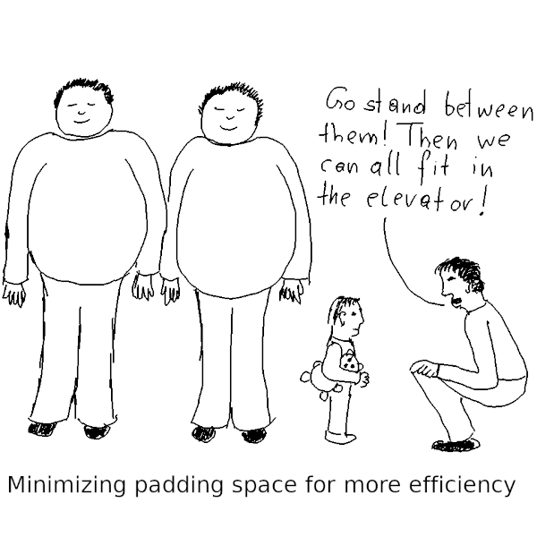

# 类型对齐与填充字节：如何避免浪费 PostgreSQL 表存储空间

<!--
<div style="text-align: center;">
  
</div>
-->


/// caption
///

节省存储空间不应该是 PostgreSQL 数据库的首要目标。很多时候，为了节省空间，人们往往会牺牲性能。但也没有理由无谓地浪费空间。因此，我们有必要掌握 PostgreSQL 中的数据类型对齐和填充字节的概念。

<!-- more -->

## 什么是数据类型对齐？

当 CPU 从内存读取或写入值时，如果值的地址是值存储空间大小的倍数，则性能最佳。例如，4 字节整数应从四的倍数的地址开始。PostgreSQL 致力于优化性能。因此，它确保所有值在内存中正确对齐。需要注意的是，对齐仅与具有固定长度的数据类型相关：PostgreSQL 存储可变长度数据类型（如 `text`、`varchar` 和 `numeric`）不必考虑类型对齐。

每当 PostgreSQL 将数据持久化到磁盘上时，它都会将这些数据组织成 8kB 大小的页面（`pages`）（也称为缓冲区（`buffers`），在磁盘上则称为块（`blocks`））。为了保持简单高效，磁盘上块的布局与内存中的页完全相同。因此，PostgreSQL 也遵循磁盘上的类型对齐。

PostgreSQL 数据类型的对齐方式可以是 1、2、4 或 8 个字节。您可以在系统目录 [`pg_type`](https://www.postgresql.org/docs/current/catalog-pg-type.html) 的 `typalign` 列中查看数据类型的对齐方式：

``` sql
SELECT typalign,
       string_agg(typname, ', ' ORDER BY length(typname)) AS types
FROM pg_type
WHERE typtype = 'b'            -- base type
  AND typelem = 0              -- no array
  AND typlen <> -1             -- fixed length
  AND typnamespace = 'pg_catalog'::regnamespace  -- system type
  AND typname NOT LIKE 'reg%'  -- no object identifier type
GROUP BY typalign;
```

``` title="输出"
 typalign │                                               types
══════════╪════════════════════════════════════════════════════════════════════════════════════════════════════
 c        │ bool, char, uuid
 d        │ xid8, time, int8, money, pg_lsn, float8, circle, timetz, aclitem, interval, timestamp, timestamptz
 i        │ cid, xid, oid, int4, date, float4, macaddr, macaddr8
 s        │ tid, int2
(4 rows)
```

上面的 `c`（类似 `char`）代表一个字节的对齐，`s`（类似 `short`）代表两个字节的对齐，`i`（类似 `int`）代表四个字节，`d`（类似 `double`）代表八个字节的对齐。为了简洁起见，我排除了对象标识符类型，因为您通常不会在表定义中使用它们。

## 什么是填充字节？

PostgreSQL 是一种“[行存储（row store）](https://www.cybertec-postgresql.com/en/citus-row-store-vs-column-store-in-postgresql/)”——它将表行存储为一个数据块，一列接一列。行数据从 8 的倍数的地址开始。因此，如果第一列是 `smallint`（大小和对齐方式为 2），第二列是 `timestamp`（大小和对齐方式为 8），则 PostgreSQL 必须在第一列和第二列之间添加 6 个“填充字节”以正确对齐时间戳。这 6 个字节只是浪费的空间！我们可以通过 `pageinspect` 扩展程序观察到这一点：

``` sql
CREATE EXTENSION pageinspect;
 
CREATE TABLE tab (
   col1 smallint,
   col2 timestamp,
   col3 integer,
   col4 double precision
);
 
INSERT INTO tab VALUES (1, '2025-01-11 12:55:32.123456', 2, pi());
 
SELECT t_data FROM heap_page_items(get_raw_page('tab', 0));
```

``` title="输出"
                               t_data                               
════════════════════════════════════════════════════════════════════
 \x0100000000000000401bc67e6cce02000200000000000000182d4454fb210940
(1 row)
```

第一个 `0100` 是 `smallint` 类型（我使用的是[小端架构](https://en.wikipedia.org/wiki/Endianness)）。接下来的 `000000000000` 是 6 个填充字节。`401bc67e6cce0200` 是时间戳，后面紧跟着整数 `02000000`。再填充 4 个字节后，我们发现双精度值 `182d4454fb210940`。

总而言之，我们浪费了 10 个字节！如果考虑行头的 24 个字节，这 10 个浪费的字节几乎占了表格行的 22%。

??? tip "提示"

    原始数据只有 `22` 字节，即 `sizeof(smallint) + sizeof(timestamp) + sizeof(integer) + sizeof(double precision)`，按此计算浪费的空间为 `10 / (22 + 24) = 0.2174`。

    如果我们按照实际的存储来算，在这 32 字节中浪费了 10 字节，因此，计算结果为 `10 / (32 + 24) = 0.1786`。

## 通过避免填充字节来节省存储空间

表中列的顺序是固定的，但通常情况下无关紧要。如果按以下顺序定义表的列，则可以避免任何填充：

- 首先，定义所有经常访问的 `uuid` 类型的列：该数据类型具有 1 字节的对齐，但固定大小为 16 个字节，因此不需要填充字节
- 接下来，定义具有 8 个字节对齐的数据类型的列（`bigint`、`timestamp`、`timestamp with time zone`、`double precision` 等）
- 然后，使用 4 字节对齐的数据类型定义列（`integer`、`date`、`real` 等）
- 然后，使用 2 字节对齐的数据类型定义列（本质上是 `smallint`）
- 最后，定义具有单字节对齐或可变长度的数据类型的列（`boolean`、`text`、`varchar`、`character`、`numeric`、其他 `uuid` 列等）

请注意，`character` 是 char 的别名（固定长度（空白填充）字符串数据类型）是一种长度可变的数据类型：首先，实际长度限制取决于类型修饰符，其次，一个字符可以有多个字节。

按照上述规则，上例中的表格将如下所示：

``` sql
CREATE TABLE tab (
   col2 timestamp,
   col4 double precision,
   col3 integer,
   col1 smallint
);
```

??? note "译者注"

    经过上述修改之后，我们可以看到如下所示的存储结构：

    ``` sql
    INSERT INTO tab values ('2025-01-11 12:55:32.123456', pi(), 2, 1);
    SELECT t_data FROM heap_page_items(get_raw_page('tab', 0));
    ```
    ```title="输出"
                         t_data
    ------------------------------------------------
     \x401bc67e6cce0200182d4454fb210940020000000100
    (1 row)
    ```

## 通过避免填充字节来节省空间对性能的影响

如上所述重新排列列顺序几乎没有任何缺点。只需考虑一点：为了访问表行的第 20 列，PostgreSQL 必须跳过前 19 列。这种操作称为元组解构（`tuple deforming`），并不是免费的。提取表中较早的列会更快。此外，跳过固定长度的列比跳过可变长度的列更便宜：对于后者，PostgreSQL 必须读取值的 `varlena` 标头。因此，如果在所有列之后定义一个经常访问的整数列，并以八个字节对齐，则可能会对性能造成轻微影响。

另一方面，如果 PostgreSQL 必须解构大量元组，它可能会调用内置的 [JIT 编译器](https://www.postgresql.org/docs/current/jit.html)。由于上一节中的规则首先排列所有固定长度的列，因此这些列的偏移量始终相同。这使得 JIT 编译器生成的可执行代码可以一步跳转到所需的列。

此外，节省空间本身也能提升性能：较小表的顺序扫描速度更快。如果不缓存填充字节，则可以在共享缓冲区中缓存更多用户数据。

总而言之，我不会太担心潜在的性能影响。

## 总结

通过精心设计表列的顺序，可以避免填充字节，从而避免浪费存储空间。这种优化不太可能损害查询性能，甚至可能提高查询性能。

> 作者：Laurenz Albe<br>
> 原文：[https://www.cybertec-postgresql.com/en/type-alignment-padding-bytes-no-space-waste-in-postgresql/](https://www.cybertec-postgresql.com/en/type-alignment-padding-bytes-no-space-waste-in-postgresql/)
